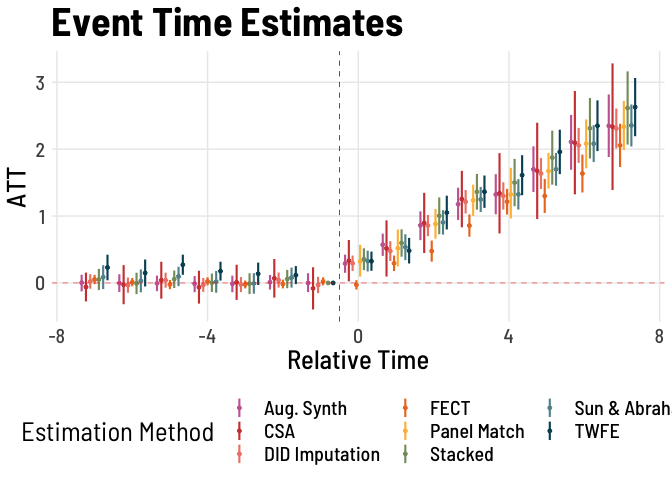

Comparing Staggered DiD
================
Florian M. Hollenbach
2021-12-27

# Comparing different staggered Difference-in-Differences Estimators

**Note: this is not supposed to be an evaluation of the different
estimators/packages.**

Let’s load packages and set up the ggplot theme, which is stolen from
[Andrew Heiss](https://www.andrewheiss.com/).

    ## Loading required package: fixest

    ## ── Attaching packages ────────────────────────────────── tidyverse 1.3.1.9000 ──

    ## ✓ ggplot2 3.3.5     ✓ purrr   0.3.4
    ## ✓ tibble  3.1.6     ✓ dplyr   1.0.7
    ## ✓ tidyr   1.1.4     ✓ stringr 1.4.0
    ## ✓ readr   2.1.1     ✓ forcats 0.5.1

    ## ── Conflicts ────────────────────────────────────────── tidyverse_conflicts() ──
    ## x dplyr::filter() masks stats::filter()
    ## x dplyr::lag()    masks stats::lag()

    ## ## See bit.ly/panelview4r for more info.
    ## ## Report bugs -> yiqingxu@stanford.edu.

    ## Registered S3 method overwritten by 'GGally':
    ##   method from   
    ##   +.gg   ggplot2

First, we create a simulated data set, with staggered treatments,
heterogeneous and dynamic treatment effects. The code is based on the
simulations in Baker, Larcker, and Wang (2021), except we have a
never-treated group and decreased the number of units.[^1]

``` r
# Data 6 - Multiple Treatment Periods and Dynamic Treatment Effects --------------
make_data6 <- function(...) {
  
  # Fixed Effects ------------------------------------------------
  # unit fixed effects
  unit <- tibble(
    unit = 1:200, 
    unit_fe = rnorm(200, 0, 0.5),
    # generate state
    state = sample(1:50, 200, replace = TRUE),
    # generate treatment groups
    group = case_when(
      state %in% 1:10 ~ 1989,
      state %in% 11:20 ~ 1998,
      state %in% 21:35 ~ NA_real_, ## never treated
      state %in% 36:50 ~ 2005
    ),
    # avg yearly treatment effects by group
    hat_gamma = case_when(
      is.na(group) ~ 0, ## never treated
      group == 1989 ~ .5,
      group == 1998 ~ .3,
      group == 2005 ~ .1
    )) %>%
    # generate unit specific yearly treatment effects 
    rowwise() %>% 
    mutate(gamma = if_else(is.na(group) == TRUE, 0, rnorm(1, hat_gamma, .2))) %>% 
    ungroup()
  
  # year fixed effects 
  year <- tibble(
    year = 1980:2015,
    year_fe = rnorm(36, 0, 0.5))
  
  # full interaction of unit X year 
  crossing(unit, year) %>% 
    # make error term and get treatment indicators and treatment effects
    mutate(error = rnorm(nrow(.), 0, 0.5),
           treat = ifelse(year >= group & is.na(group)==F, 1, 0), # 0 for ## never treated
           tau = ifelse(treat == 1 & is.na(group)==F, gamma, 0)) %>% # 0 for ## never treated
    # calculate the dep variable
    group_by(unit) %>% 
    mutate(cumtau = cumsum(tau)) %>% 
    mutate(dep_var = unit_fe + year_fe + cumtau + error)
}

# make data
#and treatment group variable for CSA
data <- make_data6() %>% 
  as_tibble() %>%
  mutate(group_CSA = if_else(is.na(group), 0, group), # CSA wants never treated cohort variable to be 0
         group = if_else(is.na(group), 10000, group), # never treated cohort variable 10000 for fixest
         time_to_treatment = ifelse(group != 10000, year - group, -1000)) # set time to treatment to -1000 for fixest
```

We can plot the data and treatment status using Licheng Liu and Yiqing
Xu’s awesome `panelView` package (Liu and Xu 2021).

``` r
panelView(dep_var ~ treat, data = data, index = c("unit","year"), xlab = "Year", ylab = "Unit", axis.lab.gap = 5)
```

<!-- --> Next,
we create the stacked data set, once again following the code by [Andrew
Baker](https://github.com/andrewchbaker/DiD_Codes).

``` r
### for stacking
groups <- data %>% 
  filter(group != 10000) %>% 
  pull(group) %>% 
  unique()

### create stacked data
getdata <- function(i) {
  
  #keep what we need
  data %>% 
    # keep treated units and all units not treated within -5 to 5
    filter(group == i | group > i + 7) %>% 
    # keep just year -5 to 5
    filter(year >= i - 7 & year <= i + 7) %>%
    # create an indicator for the dataset
    mutate(df = i) %>% 
    mutate(time_to_treatment = year - group) %>% 
    # make dummies
    mutate(time_to_treatment = if_else(group == i, time_to_treatment, 0))
}
stacked_data <- map_df(groups, getdata) %>% 
  mutate(bracket_df = paste(state,df))
```

Now we can move on to estimating the different models. First, the
standard two-way fixed effects model with dynamic event time estimates.
We estimate the model using the `fixest` package (Bergé 2018) and
extract the dynamic event time estimates.

``` r
twfe <- data %>% 
  do(broom::tidy(feols(dep_var ~ + i(time_to_treatment, ref = c(-1, -1000)) | unit + year, 
                       data = ., cluster = ~state), conf.int = TRUE)) %>% 
  mutate(t =  as.double(str_replace_all(term, c("time_to_treatment::" = "", ":treated" = "")))) %>% 
  filter(t > -8 & t < 8) %>% 
  select(t, estimate, conf.low, conf.high) %>% 
  # add in data for year -1
  bind_rows(tibble(t = -1, estimate = 0, 
                   conf.low = 0, conf.high = 0
  )) %>% 
  mutate(method = "TWFE")
```

Next, the same model but on the stacked data. Following Baker, Larcker,
and Wang (2021), we cluster standard errors at the unit×dataset
interaction.

``` r
stacked <- stacked_data %>% 
  # fit the model
  do(broom::tidy(feols(dep_var ~ i(time_to_treatment, ref = c(-1, -1000)) | unit^df + year^df, data = ., cluster = "bracket_df"),
                 conf.int = TRUE)) %>% 
  mutate(t =  as.double(str_replace(term, "time_to_treatment::", ""))) %>% 
  filter(t > -8 & t < 8) %>% 
  select(t, estimate, conf.low, conf.high) %>% 
  # add in data for year -1
  bind_rows(tibble(t = -1, estimate = 0, 
                   conf.low = 0, conf.high = 0
  )) %>% 
  mutate(method = "Stacked")
```

We continue using the `fixest` package and its `sunab` function to
estimate the dynamic effects using the Sun & Abraham method (Sun and
Abraham 2021).

``` r
SA <- data %>% 
  do(broom::tidy(feols(dep_var ~ sunab(group, year) | unit + year, data = .,
                 cluster = ~ state))) %>% 
  mutate(t =  as.double(str_replace(term, "year::", "")),
         conf.low = estimate - (qnorm(0.975)*std.error),
         conf.high = estimate + (qnorm(0.975)*std.error)) %>% 
  filter(t > -8 & t < 8) %>% 
  select(t, estimate, conf.low, conf.high) %>% 
  mutate(method = "Sun & Abraham")
```

The next model to estimate is the doubly-robust estimator developed by
Callaway and Sant’Anna (2021b) and available in the `did` package
(Callaway and Sant’Anna 2021a). We use the `not-yet-treated` as the
control group, standard errors are clustered at the treatment level
(state). It should be noted that Callaway and Sant’Anna (2021b) use
simultaneous inference procedures which are robust to multiple testing
but increase the size of confidence intervals.

``` r
csa.est<- att_gt(yname= 'dep_var',
             tname= 'year',
             idname = 'unit',
             gname = 'group_CSA',
             clustervars = 'state',
             est_method = 'dr',
             control_group = 'not-yet-treated',
             data = data) 

CSA <- aggte(csa.est, type = "dynamic", na.rm = TRUE) %>% 
  tidy() %>% 
  rename(t = event.time) %>% 
  filter(t > -8 & t < 8) %>% 
  select(t, estimate, conf.low, conf.high) %>% 
  mutate(method = "CSA")
```

Now we use the `didimputation` package written by Kyle Butts
\[butts.2021.didimputation\] based on the paper by Borusyak, Jaravel,
and Spiess (2021).

``` r
did_imp <- did_imputation(data = data, yname = "dep_var", gname = "group_CSA",
                          tname = "year", idname = "unit", 
                          horizon=TRUE, pretrends = -10:-1) 
coef_imp <- did_imp %>% 
  select(t = term, estimate, std.error) %>%
  mutate(
    conf.low = estimate - 1.96 * std.error,
    conf.high = estimate + 1.96 * std.error,
    t = as.numeric(t)
  ) %>%
  mutate(method = "DID Imputation") %>% 
  select(c(t, estimate, conf.low, conf.high, method)) %>% 
  filter(t > -8 & t < 8)
```

Next, we add the augmented synthetic control estimates for staggered
adoption (Ben-Michael, Feller, and Rothstein 2021) using the `augsynth`
package provided by Ben-Michael (2021).

``` r
asyn_res <- multisynth(dep_var ~ treat,
                   unit, 
                   year, 
                   data)

asyn <- summary(asyn_res)$att %>% 
  filter(Time > -8 & Time < 8 & (Level == 'Average')) %>%
  rename(t = Time, estimate = Estimate, conf.low = lower_bound, conf.high = upper_bound) %>% 
  mutate(method = "Aug. Synth") %>% 
  select(c(t, estimate, conf.low, conf.high, method))
```

Lastly, we use the `fect` package by Liu et al. (2021) and estimate a
counterfactul estimator chosen via cross-validation (Liu, Wang, and Xu
2021).

``` r
fect.res <- data %>% 
  fect(dep_var ~ treat, data = ., 
       index = c("unit","year"), 
       method = "both",
       CV = TRUE, 
       se = TRUE, 
       nboots = 500, 
       parallel = TRUE, 
       cv.treat = FALSE)
```

    ## Parallel computing ...
    ## Cross-validating ... 
    ## Criterion: Mean Squared Prediction Error
    ## Interactive fixed effects model...
    ## 
    ##  r = 0; sigma2 = 0.24594; IC = -0.98374; PC = 0.23377; MSPE = 0.25846; GMSPE = 0.06675; Moment = 0.05937; MSPTATT = 0.00123; MSE = 0.23419*
    ##  r = 1; sigma2 = 0.23805; IC = -0.60102; PC = 0.28198; MSPE = 0.29146; GMSPE = 0.07945; Moment = 0.06798; MSPTATT = 0.00127; MSE = 0.21116
    ##  r = 2; sigma2 = 0.23098; IC = -0.21938; PC = 0.32776; MSPE = 0.34917; GMSPE = 0.09068; Moment = 0.06388; MSPTATT = 0.00090; MSE = 0.19200
    ##  r = 3; sigma2 = 0.22354; IC = 0.15610; PC = 0.36970; MSPE = 0.43069; GMSPE = 0.10096; Moment = 0.07597; MSPTATT = 0.00096; MSE = 0.17147
    ##  r = 4; sigma2 = 0.21703; IC = 0.53122; PC = 0.41001; MSPE = 0.48773; GMSPE = 0.11763; Moment = 0.07404; MSPTATT = 0.00098; MSE = 0.15237
    ##  r = 5; sigma2 = 0.20927; IC = 0.89591; PC = 0.44468; MSPE = 0.53300; GMSPE = 0.14317; Moment = 0.07045; MSPTATT = 0.00071; MSE = 0.13361
    ## 
    ##  r* = 0
    ## 
    ## Matrix completion method...
    ## 
    ##  lambda.norm = 1.00000; MSPE = 0.25846; GMSPE = 0.06675; Moment = 0.05937; MSPTATT = 0.00123; MSE = 0.23419*
    ##  lambda.norm = 0.42170; MSPE = 0.27182; GMSPE = 0.07157; Moment = 0.06584; MSPTATT = 0.00038; MSE = 0.07751
    ##  lambda.norm = 0.17783; MSPE = 0.28195; GMSPE = 0.07701; Moment = 0.06617; MSPTATT = 0.00007; MSE = 0.01424
    ##  lambda.norm = 0.07499; MSPE = 0.27824; GMSPE = 0.07668; Moment = 0.06540; MSPTATT = 0.00001; MSE = 0.00254
    ## 
    ##  lambda.norm* = 1
    ## 
    ## 
    ## 
    ##  Recommended method through cross-validation: ife
    ## 
    ## Bootstrapping for uncertainties ... 500 runs
    ## Cannot use full pre-treatment periods. The first period is removed.
    ## Call:
    ## fect.formula(formula = dep_var ~ treat, data = ., index = c("unit", 
    ##     "year"), CV = TRUE, cv.treat = FALSE, method = "both", se = TRUE, 
    ##     nboots = 500, parallel = TRUE)
    ## 
    ## ATT:
    ##                             ATT   S.E. CI.lower CI.upper p.value
    ## Tr obs equally weighted   4.214 0.3575    3.514    4.915       0
    ## Tr units equally weighted 3.180 0.3016    2.588    3.771       0

``` r
fect <- fect.res$est.att %>% 
  as_tibble() %>% 
  mutate(t = as.double(rownames(fect.res$est.att))) %>% 
  filter(t > -8 & t < 8) %>% 
  mutate(method = "FECT") %>% 
  rename(estimate = ATT, conf.low = CI.lower, conf.high = CI.upper) %>% 
  select(c(t, estimate, conf.low, conf.high, method))
```

Lastly, we can use the `PanelMatch` package (Kim et al. 2021) to add the
panel match estimator by Imai, Kim, and Wang (Forthcoming).

``` r
PM_est <- PanelMatch(lag = 5, time.id = "year", unit.id = "unit", 
                     treatment = "treat", refinement.method = "none", 
                     data = as.data.frame(data), match.missing = TRUE, 
                     size.match = 5, qoi = "att" , outcome.var = "dep_var",
                     lead = 0:7, forbid.treatment.reversal = TRUE, 
                     use.diagonal.variance.matrix = TRUE)
PM_est <- PanelEstimate(sets = PM_est, data = as.data.frame(data))

PM <- tibble(t = c(0, 1, 2, 3, 4, 5, 6, 7), estimate = summary(PM_est)$summary[, 1], conf.low = summary(PM_est)$summary[, 3], conf.high = summary(PM_est)$summary[, 4]) %>% 
  select(t, estimate, conf.low, conf.high) %>% 
  mutate(method = "Panel Match")
```

    ## Matches created with 5 lags
    ## 
    ## Standard errors computed with 1000 Weighted bootstrap samples
    ## 
    ## Estimate of Average Treatment Effect on the Treated (ATT) by Period:
    ## Matches created with 5 lags
    ## 
    ## Standard errors computed with 1000 Weighted bootstrap samples
    ## 
    ## Estimate of Average Treatment Effect on the Treated (ATT) by Period:
    ## Matches created with 5 lags
    ## 
    ## Standard errors computed with 1000 Weighted bootstrap samples
    ## 
    ## Estimate of Average Treatment Effect on the Treated (ATT) by Period:

``` r
coefs <- bind_rows(twfe, stacked, CSA, SA, coef_imp, asyn, fect, PM) 

plot <- coefs %>% 
  ggplot(aes(x = t, y = estimate, color = method)) + 
  geom_point(aes(x = t, y = estimate), position = position_dodge2(width = 0.8), size = 1) +
  geom_linerange(aes(x = t, ymin = conf.low, ymax = conf.high), position = position_dodge2(width = 0.8), size = 0.75) +
  geom_hline(yintercept = 0, linetype = "dashed", color = "red", size = .25, alpha = 0.75) + 
  geom_vline(xintercept = -0.5, linetype = "dashed", size = .25) +
  scale_color_manual(name="Estimation Method", values= met.brewer("Cross", 8, "discrete")) +
  theme_clean() + theme(legend.position= 'bottom') +
  labs(title = 'Event Time Estimates', y="ATT", x = "Relative Time") + 
  guides(col = guide_legend(nrow = 3)) 
plot
```

<!-- -->

<div id="refs" class="references csl-bib-body hanging-indent">

<div id="ref-baker.2021.how" class="csl-entry">

Baker, Andrew, David F. Larcker, and Charles C. Y Wang. 2021. “How Much
Should We Trust Staggered Difference-in-Differences Estimates?”
<http://dx.doi.org/10.2139/ssrn.3794018>.

</div>

<div id="ref-eli.2021.augsynth" class="csl-entry">

Ben-Michael, Eli. 2021. *Augsynth: The Augmented Synthetic Control
Method*.

</div>

<div id="ref-ben-michael.2021.augmented" class="csl-entry">

Ben-Michael, Eli, Avi Feller, and Jesse Rothstein. 2021. “The Augmented
Synthetic Control Method.” *Journal of the American Statistical
Association* 116 (536): 1789–1803.
<https://doi.org/10.1080/01621459.2021.1929245>.

</div>

<div id="ref-berge.2018.efficient" class="csl-entry">

Bergé, Laurent. 2018. “Efficient Estimation of Maximum Likelihood Models
with Multiple Fixed-Effects: The R Package FENmlm.” *CREA Discussion
Papers*, no. 13.

</div>

<div id="ref-borusyak.2021.revisiting" class="csl-entry">

Borusyak, Kirill, Xavier Jaravel, and Jann Spiess. 2021. “Revisiting
Event Study Designs: Robust and Efficient Estimation.”
<https://www.dropbox.com/s/y92mmyndlbkufo1/Draft_RobustAndEfficient.pdf?raw=1>.

</div>

<div id="ref-callaway.2021.did" class="csl-entry">

Callaway, Brantly, and Pedro H. C. Sant’Anna. 2021a. “Did: Difference in
Differences.” <https://bcallaway11.github.io/did/>.

</div>

<div id="ref-callaway.2021.difference" class="csl-entry">

———. 2021b. “Difference-in-Differences with Multiple Time Periods.”
*Journal of Econometrics*.
<https://doi.org/10.1016/j.jeconom.2020.12.001>.

</div>

<div id="ref-imai.2021.matching" class="csl-entry">

Imai, Kosuke, In Song Kim, and Erik Wang. Forthcoming. “Matching Methods
for Causal Inference with Time-Series Cross-Sectional Data.” *American
Journal of Political Science*, Forthcoming.
[\\url{https://imai.fas.harvard.edu/research/tscs.html}](\url{https://imai.fas.harvard.edu/research/tscs.html}).

</div>

<div id="ref-kim.2021.panelmatch" class="csl-entry">

Kim, In Song, Adam Rauh, Erik Wang, and Kosuke Imai. 2021. *PanelMatch:
Matching Methods for Causal Inference with Time-Series Cross-Sectional
Data*. <https://CRAN.R-project.org/package=PanelMatch>.

</div>

<div id="ref-liu.2021.practical" class="csl-entry">

Liu, Licheng, Ye Wang, and Yiqing Xu. 2021. “A Practical Guide to
Counterfactual Estimators for Causal Inference with Time-Series
Cross-Sectional Data.” <http://dx.doi.org/10.2139/ssrn.3555463>.

</div>

<div id="ref-liu.2021.fect" class="csl-entry">

Liu, Licheng, Ye Wang, Yiqing Xu, and Ziyi Liu. 2021. *Fect: Fixed
Effects Counterfactuals*.
<https://yiqingxu.org/packages/fect/fect.html>.

</div>

<div id="ref-liu.2021.panelview" class="csl-entry">

Liu, Licheng, and Yiqing Xu. 2021. *panelView: Visualizing Panel Data*.
<https://yiqingxu.org/packages/panelView/panelView.html>.

</div>

<div id="ref-sun.2021.estimating" class="csl-entry">

Sun, Liyang, and Sarah Abraham. 2021. “Estimating Dynamic Treatment
Effects in Event Studies with Heterogeneous Treatment Effects.” *Journal
of Econometrics* 225: 175–99.
https://doi.org/<https://doi.org/10.1016/j.jeconom.2020.09.006>.

</div>

</div>

[^1]: Thanks to Andrew Baker for sharing his code
    [here](https://github.com/andrewchbaker/DiD_Codes).
